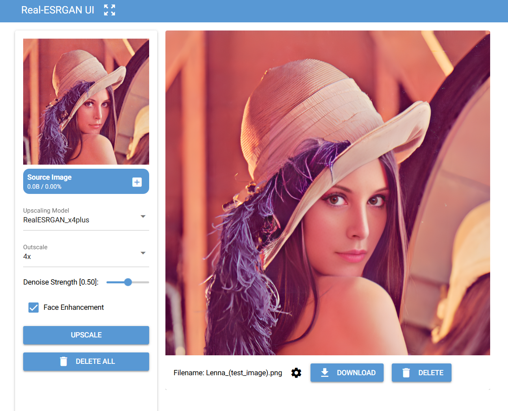

## About

A simple browser-based UI for [Real-ESRGAN](https://github.com/xinntao/Real-ESRGAN) (an AI image upscaling tool),
packaged as a dockerized project to simplify installation.

## Installation

### Prerequisites
- *Docker Desktop* must be installed

### Launching the application
- Clone the project
- Navigate into the project directory
- Start the application via `docker compose up`
  - This launches the application on http://localhost
- `Ctrl+C` or `docker compose down` to stop the application

## Misc
- A REST endpoint for the upscaling backend is exposed at `[POST] /upscale`, refer to the *Swagger* page at `/docs` for more details

## Remarks:
* Video upscaling is not supported
* GPU acceleration is not enabled

## Disclaimer
This project is unaffliated with [Real-ESRGAN](https://github.com/xinntao/Real-ESRGAN) (License file titled *REALESRGAN-LICENSE*)

